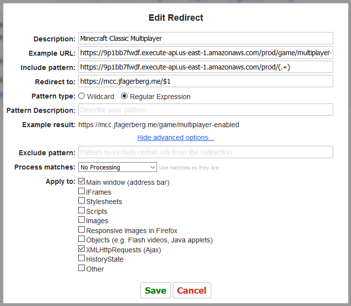
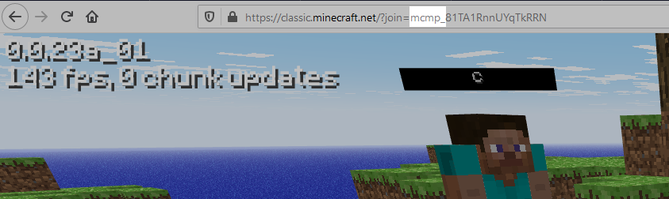

# Connecting to the Minecraft Classic Server

Before you can use the Minecraft Classic server, you'll need a browser extension that redirects the requests that would normally go to Mojang to your server instead.

I personally use Redirector ([Chrome](https://chrome.google.com/webstore/detail/redirector/ocgpenflpmgnfapjedencafcfakcekcd?hl=en), [Firefox](https://addons.mozilla.org/en-US/firefox/addon/redirector/)), so this is what I will use to explain the necessary redirects. If you use another extension, it is likely that the steps are equivalent.

First step is to find your way to Redirector's settings page. You can do this by clicking its icon in your browser bar and pressing "Edit Redirects". If you can't find its icon, you can also go to your extensions page (`chrome://extensions` in Chrome, `about:addons` in Firefox) and find it there. Click "Details" in Chrome, or the three dots in Firefox, and select "Options for extension"/"Options". This will show you the same buttons as if you had the icon in your browser bar.

    

Second step is to set up the actual redirect rule. At the time of writing I am hosting a server on `https://mcc.jfagerberg.me`. To use it, you should insert the following values:

<table>
    <tr>
        <td><b>Description</b></td>
        <td>Minecraft Classic Multiplayer</td>
    </tr>
    <tr>
        <td><b>Example URL</b></td>
        <td><code>https://9p1bb7fwdf.execute-api.us-east-1.amazonaws.com/prod/game/multiplayer-enabled</code></td>
    </tr>
    <tr>
        <td><b>Include pattern</b></td>
        <td><code>https://9p1bb7fwdf.execute-api.us-east-1.amazonaws.com/prod/(.+)</code></td>
    </tr>
    <tr>
        <td><b>Redirect to</b></td>
        <td><code>https://mcc.jfagerberg.me/$1</code></td>
    </tr>
    <tr>
        <td><b>Pattern type</b></td>
        <td>Regular Expression</td>
    </tr>
</table>

Make sure that the "Example result" shows `https://mcc.jfagerberg.me/game/multiplayer-enabled`. Finally click "Show advanced options..." and make sure "XMLHttpRequests (Ajax)" is checked.

    

If you are hosting the server locally (if you're in doubt, you didn't) then you should replace `https://mcc.jfagerberg.me` with `http://localhost:9876`.

That's it! You can test if it works by going to [classic.minecraft.net](https://classic.minecraft.net) in your browser. If it worked, your URL will contain `?join=mcmp_`.

    

